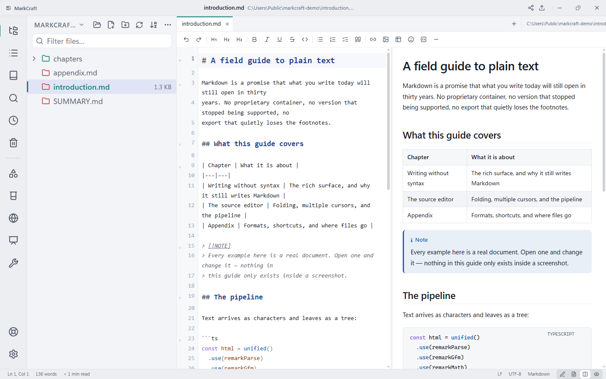
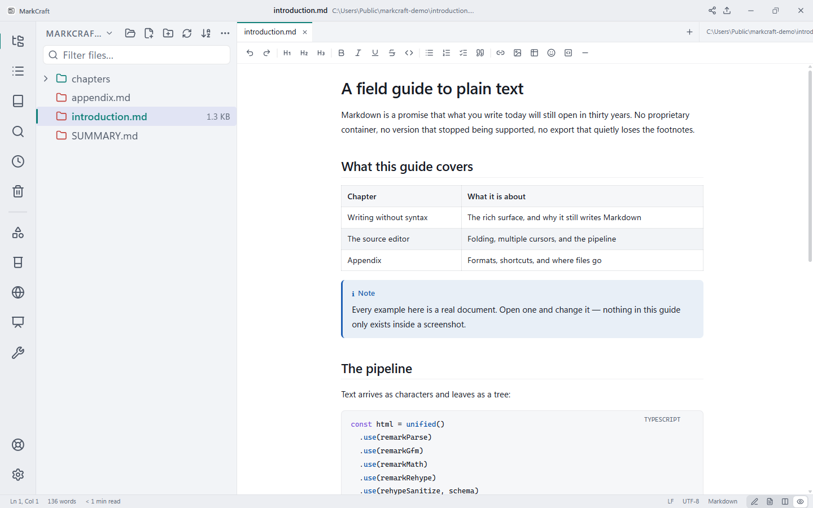
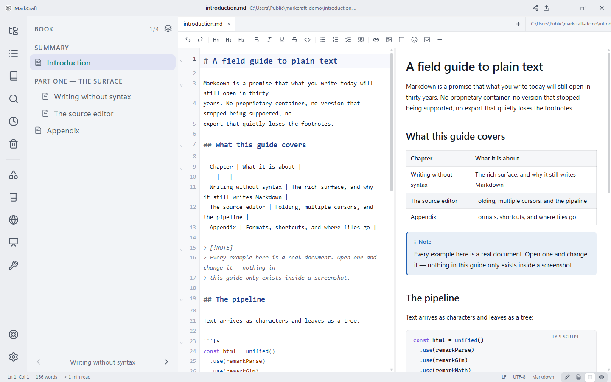
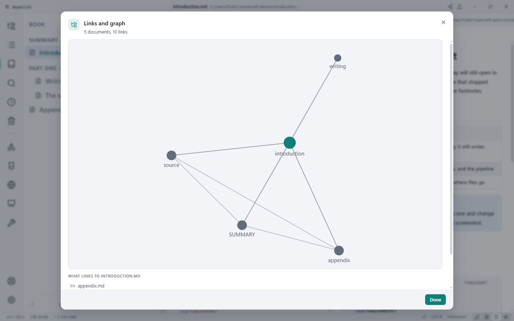
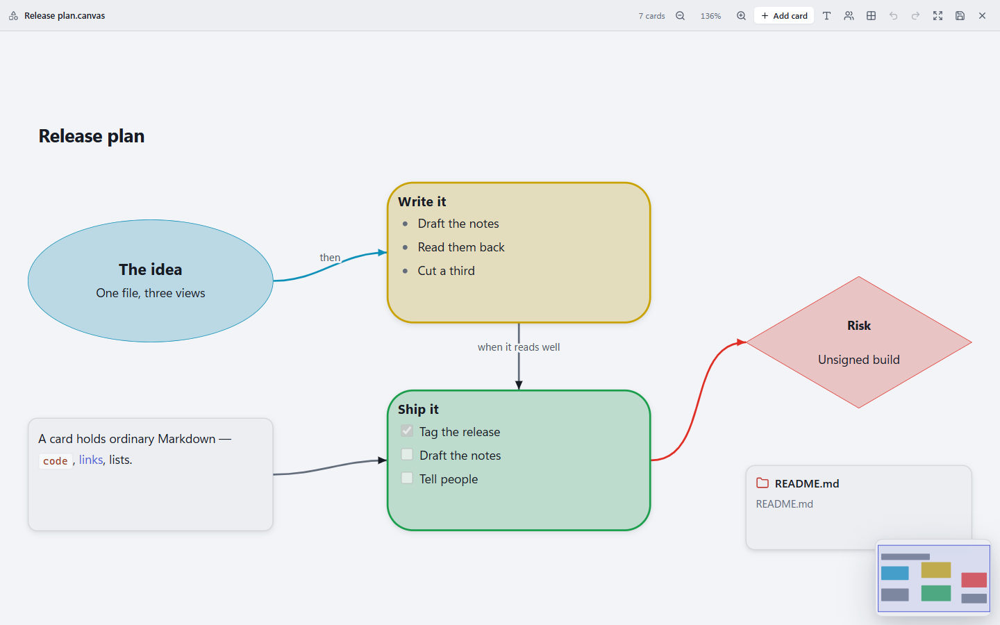
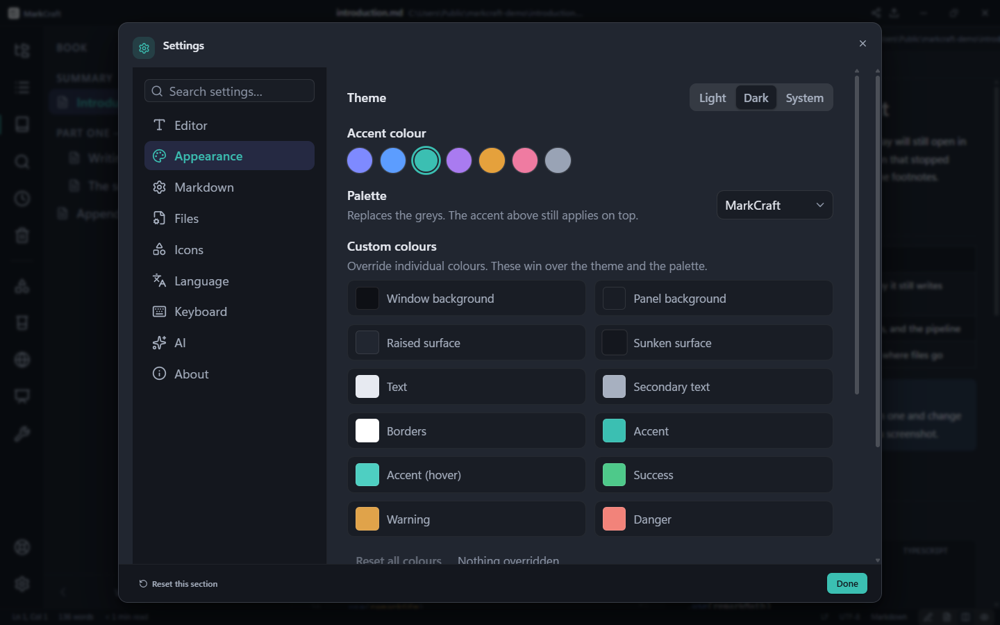

# MarkCraft

**English** · [Azərbaycanca](README.az.md) · [Русский](README.ru.md)

A professional desktop Markdown editor built with Electron, React and TypeScript.

MarkCraft is meant to serve two people equally well: the **writer**, who wants a
calm document surface and never wants to think about syntax, and the
**developer**, who wants a real source editor, a file tree, workspace search and
keyboard control of everything.

**Offline-first.** MarkCraft makes no network request of its own — no telemetry,
no update check, no fonts fetched at runtime. Three features *can* reach the
network, and each only when you press a button: the AI assistant, the HTTP
request tool, and running a code block. All three ship off or unconfigured.

---

## What it looks like

| | |
|---|---|
|  |  |
| **Split view** — the Markdown source beside the document it renders to, scrolled together. | **Preview only** — the same document with the source out of the way. |
|  |  |
| **Book mode** — a folder read through its `SUMMARY.md`, with your place in it and the next chapter one click away. | **Links and graph** — what points at what across the whole workspace, and what links to the document you have open. |
|  |  |
| **Canvas** — cards holding Markdown on an infinite surface, saved as JSON Canvas. | **Appearance** — two themes, seven palettes, seven accents, and any individual colour overridable per theme. |

---

## Writing

| | |
|---|---|
| **Three editing surfaces** | A WYSIWYG rich editor, a full Markdown source editor, and a live preview — three views of *one* document, not three copies. |
| **Split view** | Source and preview side by side, with scroll synchronisation driven by real source-line mapping rather than scroll percentages. |
| **`/` block menu** | A slash at the start of a line opens fourteen blocks. It stays quiet inside file paths and URLs, and matches both the English name and your own language. |
| **Formatting toolbar** | Choose which tools appear, and in what order. |
| **Templates** | `Ctrl/Cmd + Alt + N` starts a document from a shape — meeting notes, article, to-do — localised, not English boilerplate. |
| **Snippets** | Save a block you keep writing, give it a trigger, and reach it with `/`. It can fill in the date, the document’s name, whatever you had selected, and where the cursor should land — and it leaves a `{{ site.title }}` meant for a site generator exactly as written. |
| **Emoji picker** | `Ctrl/Cmd + Alt + M`, the toolbar, or `/emoji`. Searchable, with your most-used first. |
| **Word goals** | Set a target per document; the status bar tracks it. |
| **Writing streak** | The statistics panel counts the days you wrote. A streak that ended yesterday still counts today. The record holds a date and a number, never a filename. |
| **Focus mode** | Dims everything but the paragraph being written. A preference about how you work, so it is remembered rather than reset each session. |
| **A goal for the day** | Words a day to aim for, across everything you write. Off until you set one — a goal nobody set is a goal nobody has. |
| **Comments** | Leave a note on a passage. Comments live in a file beside the document, not inside it, and are re-found by the words they were left on — so they survive the document being edited around them, and say so plainly when the passage has gone. |

## Markdown

| | |
|---|---|
| **Callouts** | `> [!NOTE]`, `[!TIP]`, `[!IMPORTANT]`, `[!WARNING]`, `[!CAUTION]` — in the editor and in every export. |
| **Math and diagrams** | `$…$` renders with KaTeX; a `mermaid` fence becomes a diagram styled from the app's own tokens. Mermaid loads only when a document contains one. |
| **Heading anchors** | Every heading gets an id using GitHub's rules, so `[](#a-section)` works — including for non-Latin headings. |
| **Wiki links** | `[[Another note]]` links to `Another note.md`, resolved like any relative link. |
| **Code blocks** | Language label, copy button, and a language picker for the fence the caret is in — including one you have not closed yet. |
| **Run a code block** | For a language installed on this machine. Output appears under the block. No sandbox and none claimed: the code runs with your own permissions, and never on its own. |
| **Linter** | Nine rules that catch what actually renders wrong, alongside broken anchors and duplicate heading slugs. |
| **Clean up** | Repairs the four problems with one correct answer — a jammed heading, tabs, stray trailing spaces, an unclosed fence — and leaves the judgement calls alone. |

## Documents and files

| | |
|---|---|
| **Custom file explorer** | Lazy, virtualised tree with full CRUD, multi-select, drag & drop, filter and sort. Opening a 50,000-file repository costs only the folders you expand. |
| **Tabs** | Reorderable, with dirty indicators, close-others/close-all, and reopen-closed. |
| **Workspace search** | Find and replace across a folder, with globs, regex, whole-word and case options. |
| **See the replacement first** | Every match shows what it becomes, struck through beside it, computed per match through the same code that will perform it. “Replace in 40 files” is not something to press on faith. |
| **Crash recovery** | Unsaved work is journalled continuously and offered back on next launch — including for untitled documents. |
| **Conflict protection** | External changes are detected, and a save never silently overwrites a file that changed underneath you. |
| **Version history** | Every save is kept, with a diff and one-click restore. |
| **Compare two versions** | Against the editor, or against another saved version — because “what changed between Tuesday and Thursday” is a real question. |
| **Trash** | Deleted files are recoverable, with a configurable limit. |
| **Lock a document** | Turns editing off for something finished or someone else's. Enforced at the save too, so autosave respects it. |
| **Images** | Cropped, resized and compressed before they reach the document, with the resulting size shown while you decide. |
| **Drop anything** | Images are inserted, Markdown and text files opened, anything else linked relatively. |

## Seeing the work

| | |
|---|---|
| **Presentation mode** | `F5` turns the document into a deck, split on `---`. Slides render through the preview's own pipeline. |
| **Website preview** | `Ctrl/Cmd + Alt + W` shows the document at 390, 768 and 1280 pixels — a real frame at that width, so text wraps as a reader will see it. |
| **Links and graph** | `Ctrl/Cmd + Alt + L` maps how your documents reference each other, lists backlinks, and reports every broken link with its file and line. |
| **Canvas** | An infinite surface of Markdown cards and the lines between them, saved as JSON Canvas — the open format Obsidian writes. |
| **Canvas templates** | A board, a retrospective, a mind map or a row of steps, added below what is already there rather than replacing it. |
| **Arrange by the arrows** | Lay a canvas out as a tidy tree or as a ring round its busiest card. A grid makes a canvas neat; this makes it say something. |
| **Canvas as a picture** | Save the whole canvas as an SVG or a PNG, with the writing as real text and the colours resolved — a file that draws correctly outside the application, not only in it. |
| **Book mode** | A `SUMMARY.md` listing chapters turns the folder into one work — `Ctrl/Cmd + Alt + K`. The format mdBook and GitBook already use. |
| **Study mode** | Write `Term :: meaning`, or a question, a line containing only `?`, and the answer — and the note becomes revisable, with a schedule that survives rewriting around it. |
| **Reading mode** | Double-click a `.md` file and it opens as the rendered document with an Edit button, not a split-pane editor. |
| **Outline** | A live table of contents — `Ctrl/Cmd + Shift + U`. Parsed from the Markdown, so it works in every view mode. |

## Export

Markdown · plain text · rich text (`.rtf`) · Word (`.docx`) · self-contained HTML ·
paginated PDF · PNG · structured JSON.

Printing renders the document, never the editor. **Paste as Markdown** converts a
web page the other way, dropping its navigation and footer.

## Tools

| | |
|---|---|
| **Developer tools** | `Ctrl/Cmd + Alt + T`. JSON formatting, JSON↔YAML, Base64, URL escaping, JWT decoding, timestamps, a regex tester and UUIDs — all offline. |
| **HTTP request** | For the API a technical document describes. Only `http://` and `https://`, re-checked at every redirect, no cookies or credentials. |
| **Bring your own AI** | Optional, off by default. OpenRouter, OpenAI, Anthropic, Gemini, Groq, DeepSeek, Mistral, Together, xAI, Fireworks — or a local Ollama / LM Studio. Tidy up, add detail, summarise, review, or give your own instruction. Keys are encrypted per OS account and never touch `settings.json`. |

## Making it yours

| | |
|---|---|
| **Themes** | Light, dark and system, seven accent colours, six named palettes (Nord, Solarized, Gruvbox, Rosé Pine, Sepia, high-contrast), and per-token colour overrides with a built-in picker. |
| **Custom icons** | Give a file, a folder, or a whole file type its own icon and colour — from the built-in set or your own SVGs. |
| **Three languages** | English, Azerbaijani and Russian — and a fourth is a JSON file you drop into the app's data folder, no rebuild required. |
| **Rebindable shortcuts** | Every command's accelerator can be changed in Settings → Keyboard. |
| **Command palette** | `Ctrl/Cmd + Shift + P`. Every action in the app is one searchable list. |
| **Searchable settings** | Type into Settings to find any preference; choosing a result opens its page with the control highlighted. |
| **Interface zoom** | `Ctrl/Cmd +` and `Ctrl/Cmd -` scale the sidebar and settings independently of the editor text. |

---

## Getting started

```bash
npm install
npm run dev        # development, with hot reload
npm run build      # typecheck + bundle
npm run dist       # installers for the current platform
```

| Script | |
|---|---|
| `npm test` | The unit suite — 664 tests |
| `npm run typecheck` | Both TypeScript projects, main and renderer |
| `npm run lint` | ESLint, including the vendor-boundary rules |
| `npm run package` | An unpacked build, without an installer |

**On CI.** Type-check, lint and the test suite run on Linux, macOS and Windows
for every push. Installers — an NSIS setup, a `.dmg`, an AppImage and a `.deb` —
are built on all three when a `v*` tag is pushed, and collected into a **draft**
release for a person to look at before anything goes out. They are unsigned:
signing needs a certificate the project does not have, and an honest unsigned
build beats a half-signed one.

---

## Keyboard shortcuts

A selection — the full list, with rebinding, is in **Settings → Keyboard**, and
everything is reachable from the command palette.

| Action | Shortcut |
|---|---|
| Command palette | `Ctrl/Cmd + Shift + P` |
| New / Open / Save | `Ctrl/Cmd + N` / `O` / `S` |
| Save As | `Ctrl/Cmd + Shift + S` |
| Open folder | `Ctrl/Cmd + Shift + O` |
| Close tab / Reopen closed | `Ctrl/Cmd + W` / `Ctrl/Cmd + Shift + T` |
| Find / Replace | `Ctrl/Cmd + F` / `Ctrl/Cmd + H` |
| Search workspace | `Ctrl/Cmd + Shift + F` |
| Go to line | `Ctrl/Cmd + G` |
| Bold / Italic / Inline code | `Ctrl/Cmd + B` / `I` / `E` |
| Insert link | `Ctrl/Cmd + K` |
| Heading 1–6 / Paragraph | `Ctrl/Cmd + 1…6` / `Ctrl/Cmd + 0` |
| Cycle view mode | `Ctrl/Cmd + Shift + V` |
| Reading mode | `Ctrl/Cmd + Shift + R` |
| Outline | `Ctrl/Cmd + Shift + U` |
| Presentation mode | `F5` |
| Website preview | `Ctrl/Cmd + Alt + W` |
| Links and graph | `Ctrl/Cmd + Alt + L` |
| Book | `Ctrl/Cmd + Alt + K` |
| Developer tools | `Ctrl/Cmd + Alt + T` |
| Insert emoji | `Ctrl/Cmd + Alt + M` |
| New from template | `Ctrl/Cmd + Alt + N` |
| Print / Export | `Ctrl/Cmd + P` / `Ctrl/Cmd + Alt + E` |
| Toggle sidebar / theme | `Ctrl/Cmd + Alt + B` / `Ctrl/Cmd + Shift + D` |
| Settings | `Ctrl/Cmd + ,` |

---

## Documentation

- [ARCHITECTURE.md](ARCHITECTURE.md) — how the process boundary, the editors and the Markdown pipeline fit together
- [DEVELOPMENT.md](DEVELOPMENT.md) — conventions, the vendor boundary, and how to add a feature

## A note on the rich editor

The WYSIWYG surface and the Markdown source are two views of one document, kept
in step by a driver/follower rule: whichever surface the user is typing in
drives, and the other follows on a debounce. That is what stops the two from
echoing each other into an edit loop, and it is why a round trip through the
rich editor does not reformat your Markdown.

## Licence

MIT — see [LICENSE](LICENSE).
